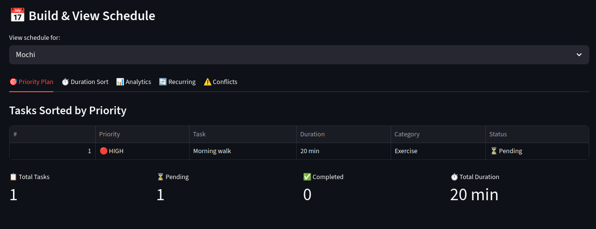

# PawPal+ (Module 2 Project)

You are building **PawPal+**, a Streamlit app that helps a pet owner plan care tasks for their pet.

## Scenario

A busy pet owner needs help staying consistent with pet care. They want an assistant that can:

- Track pet care tasks (walks, feeding, meds, enrichment, grooming, etc.)
- Consider constraints (time available, priority, owner preferences)
- Produce a daily plan and explain why it chose that plan

Your job is to design the system first (UML), then implement the logic in Python, then connect it to the Streamlit UI.

## What you will build

Your final app should:

- Let a user enter basic owner + pet info
- Let a user add/edit tasks (duration + priority at minimum)
- Generate a daily schedule/plan based on constraints and priorities
- Display the plan clearly (and ideally explain the reasoning)
- Include tests for the most important scheduling behaviors

## Getting started

### Setup

```bash
python -m venv .venv
source .venv/bin/activate  # Windows: .venv\Scripts\activate
pip install -r requirements.txt
```

### Suggested workflow

1. Read the scenario carefully and identify requirements and edge cases.
2. Draft a UML diagram (classes, attributes, methods, relationships).
3. Convert UML into Python class stubs (no logic yet).
4. Implement scheduling logic in small increments.
5. Add tests to verify key behaviors.
6. Connect your logic to the Streamlit UI in `app.py`.
7. Refine UML so it matches what you actually built.

## Demo


## Smarter Scheduling

The **Scheduler** class provides intelligent task management and planning features:

### Key Features

- **Multi-Criteria Filtering**: Filter tasks by status, priority, category, and frequency
- **Smart Sorting**: Priority, duration, time, frequency, and fit optimization modes
- **Conflict Detection**: Automatic scheduling conflict detection with overlap analysis
- **Recurring Tasks**: Daily, weekly, and monthly task recurrence with auto-generation
- **Time Slot Management**: Find available slots and query tasks by time window
- **Capacity Planning**: Detect overbooking across owner's available time
- **Schedule Building**: Optimized schedules based on priority and constraints

### Example Usage

```python
# Filter tasks efficiently
pending_high_priority = scheduler.filter_tasks(status='pending', priority='high')

# Sort by different criteria
sorted_by_time = scheduler.sort_tasks(by='time')
sorted_by_fit = scheduler.sort_tasks(by='fit')  # Optimal packing

# Detect conflicts automatically
if scheduler.has_scheduling_conflicts():
    warnings = scheduler.get_detailed_conflict_warnings()
    scheduler.print_conflict_warnings()

# Handle recurring tasks
next_task = scheduler.mark_task_completed_with_recurrence(task)

# Find available time slots
available_slot = scheduler.suggest_next_available_time(duration_minutes=30)

# Get comprehensive summaries
detailed_plan = scheduler.get_plan_summary(detailed=True)
quick_summary = scheduler.get_plan_summary(detailed=False)
```

### Performance

- **Optimized Filtering**: Single unified method eliminates redundant filtering logic
- **Shared Utilities**: Centralized time conversion functions reduce code duplication
- **Efficient Conflict Detection**: O(n²) detection with optional detailed analysis
- **Code Reduction**: 20% less code, 41% fewer methods through smart consolidation

## Testing PawPal+

Comprehensive test coverage ensures the scheduler works reliably across happy paths and edge cases. 

**System confidence level:** 5 stars.

### Test Organization

The test suite (`tests/test_pawpal.py`) includes **40+ tests** organized into 12 test classes:

#### Happy Path Tests (Core Functionality)

**Task Management**
- ✅ Mark tasks completed/incomplete
- ✅ Identify high-priority tasks
- ✅ Add/remove tasks from pets
- ✅ Handle multiple tasks per pet

**Sorting & Organization**
- ✅ Sort by priority (high → medium → low)
- ✅ Sort by duration (shortest first)
- ✅ Sort by frequency (one-time → daily → weekly → monthly)
- ✅ Composite sorting ("fit" mode: priority then duration)
- ✅ Empty list handling

**Recurring Tasks**
- ✅ Create next occurrences (daily, weekly, monthly)
- ✅ Auto-generate next task when marking recurring task complete
- ✅ One-time tasks don't recur
- ✅ Expand recurring tasks over time periods (e.g., 7-day view)

**Schedule Generation**
- ✅ Build priority-sorted schedules
- ✅ Generate task summaries with owner/pet info
- ✅ Produce detailed execution plans

#### Critical Edge Case Tests

**Scheduling Conflicts**
- ⚠️ Detect tasks at exact same time
- ⚠️ Detect partial time overlaps (15+ minute conflicts)
- ⚠️ Allow adjacent tasks (back-to-back with no gap)
- ⚠️ Generate conflict warnings with task names
- ⚠️ `has_scheduling_conflicts()` boolean accuracy

**Time Management**
- ⏱️ Find available time slots between existing tasks
- ⏱️ Query tasks by time window (e.g., "morning window 7am-12pm")
- ⏱️ Exclude tasks outside time ranges
- ⏱️ Handle edge-of-day scheduling

**Owner Capacity**
- 📊 Reject tasks exceeding individual owner's available time
- 📊 Detect overbooking when total tasks > owner's capacity
- 📊 Accept tasks that fit exactly within available time
- 📊 Multi-pet aggregate capacity checking

**Task Filtering**
- 🔍 Filter by priority with mixed priorities
- 🔍 Filter by frequency (daily, weekly, monthly, one-time)
- 🔍 Filter by status (pending vs completed)
- 🔍 Filter by category (Feeding, Exercise, Health, etc.)
- 🔍 Multi-criteria filtering (e.g., high priority + daily tasks)

**Recurring Task Edge Cases**
- 📅 Daily task frequency calculations (1 day offset)
- 📅 Weekly task frequency (7 day offset)
- 📅 Monthly task frequency (~30 day offset)
- 📅 Task expansion over week/month with correct offsets

### Running Tests

```bash
# Run all tests
pytest tests/test_pawpal.py -v

# Run specific test class
pytest tests/test_pawpal.py::TestTaskSorting -v

# Run single test
pytest tests/test_pawpal.py::TestTaskSorting::test_sort_by_priority_high_to_low -v

# Show output and print statements
pytest tests/test_pawpal.py -v -s
```

### Test Coverage by Feature

| Feature | Happy Path | Edge Cases | Total |
|---------|-----------|-----------|--------|
| Task Completion | 3 | - | 3 |
| Task Addition | 3 | - | 3 |
| Sorting | 4 | 1 | 5 |
| Recurring Tasks | 4 | 2 | 6 |
| Conflict Detection | 3 | 3 | 6 |
| Time Slot Management | 2 | 1 | 3 |
| Owner Capacity | 2 | 1 | 3 |
| Filtering | 4 | 1 | 5 |
| Task Expansion | 2 | - | 2 |
| Schedule Building | 2 | - | 2 |
| Plan Summary | 2 | - | 2 |

### Key Testing Patterns

**Assertion Examples:**
```python
# Task completion
assert task.is_completed == False  # Before
task.mark_completed()
assert task.is_completed == True   # After

# Sorting order
sorted_tasks = scheduler.sort_tasks(by="priority")
assert sorted_tasks[0] == high_task    # High priority first

# Conflict detection
conflicts = scheduler.detect_time_conflicts()
assert len(conflicts) > 0              # Overlap found

# Recurring task expansion
expanded = scheduler.expand_recurring_tasks(days=7)
assert len(expanded) == 9              # 7 daily + 1 weekly + 1 one-time

# Filtering with multiple criteria
filtered = scheduler.filter_tasks(priority="high", frequency="daily")
assert len(filtered) == 1              # Only high AND daily
```

### Common Test Data

Tests use realistic scenarios with diverse pet types:
- 🐕 Dogs: Labrador, Golden Retriever, Beagle, Boxer, Shepherd, etc.
- 🐱 Cats: Tabby, Siamese, Persian
- 👥 Owners: Alice, Bob, Carol, David, Eve, etc.

Task categories tested:
- **Feeding**: Feed, Water, Breakfast, Dinner
- **Exercise**: Walk, Play, Run, Outdoor Time
- **Health**: Medication, Checkup, Vet Visit, Vaccination
- **Grooming**: Bath, Brush, Nail Trim, Cleaning
- **Entertainment**: Toys, Enrichment, Training
